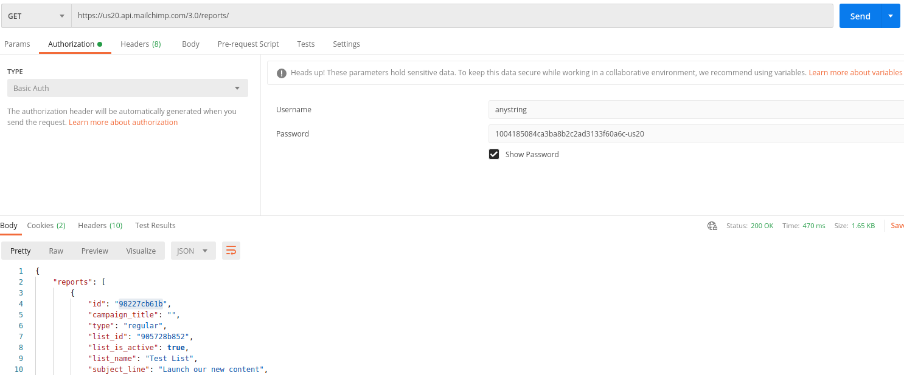

## Mailchimp to amocrm intregation

 - Click Reports Members API 


```
curl -X GET \
  'https://server.api.mailchimp.com/3.0/reports/{campaign_id}/click-details/{link_id}/members?fields=<SOME_ARRAY_VALUE>&exclude_fields=<SOME_ARRAY_VALUE>&count=10&offset=0' \
  -H 'authorization: Basic <USERNAME:PASSWORD>'
```

 - Campain id 98227cb61b


  


 - Get whole reports using api __https://us20.api.mailchimp.com/3.0/reports/__
 - Campain details __https://us20.api.mailchimp.com/3.0/reports/98227cb61b/click-details__
 - Specefic Click details from campain __https://us20.api.mailchimp.com/3.0/reports/98227cb61b/click-details/31d5626a8e__


